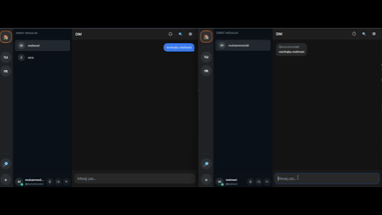

# 🌐 Cluster — Modern Discord-Style Chat Platform

**Cluster**; gerçek zamanlı iletişim, sunucular, kanallar, mesajlaşma ve medya paylaşımı özelliklerini barındıran, **Discord benzeri** bir açık kaynak sohbet uygulamasıdır.  
Backend **Spring Boot + PostgreSQL + WebSocket (STOMP)**, frontend ise **React (Vite) + TailwindCSS + TypeScript** ile geliştirilmiştir.

---

## 🚀 Özellikler

### 💬 Sohbet & Kanal Sistemi
- DM (Direct Message) ve grup sohbetleri  
- Sunucu (server) ve kanal yönetimi *(geliştirme aşamasında)*  
- Gerçek zamanlı mesaj senkronizasyonu (STOMP WebSocket)  
- Okunma durumu, sessize alma ve son görülme mantıkları *(geliştirme aşamasında)*  

### 🎧 Medya & Ses *(geliştirme aşamasında)*
- Jitsi tabanlı video/ses görüşmeleri (lib-jitsi-meet)  
- Mikrofon, kulaklık ve ses durumu kontrolü (tray sistemi)  
- Çoklu kullanıcı odaları ve ekran paylaşımı  

### 👥 Kullanıcı & Kimlik
- JWT tabanlı kimlik doğrulama  
- Profil yönetimi (avatar, kullanıcı adı, durum) *(geliştirme aşamasında)*  
- Arkadaşlık sistemi ve DM entegrasyonu  

### 🎨 Arayüz
- Tamamen **React + TailwindCSS** ile responsive arayüz  
- Discord tarzı modern, koyu tema  
- Sidebar, tray, kanal listeleri ve hover efektli kartlar *(geliştirme aşamasında)* 

---

## 📸 Ekran Görüntüleri

  
   
  <em>🔔 Arkadaşlık İstekleri Ekranı — Gelen istekleri yönetme (kabul / reddet)</em>

---

  
   
  <em>👥 Arkadaşlar Sayfası — Listeleme, arama ve DM başlatma</em>

---

  
   
  <em>💬 Direkt Mesaj (DM) Ekranı — Gerçek zamanlı birebir sohbet</em>

---

  
   
  <em>🌐 Sunucu Keşfi — Sunuculara göz atma ve katılma görünümü</em>

---

  
   
  <em>⚡ Gerçek zamanlı mesajlaşma demosu</em>

---

## 🧠 Teknolojiler
| Katman | Teknolojiler |
|:-------|:--------------|
| **Backend** | Spring Boot, JWT, WebSocket (STOMP), PostgreSQL, JPA |
| **Frontend** | React (Vite), TailwindCSS, Axios, React Router |
| **Medya** | Jitsi (lib-jitsi-meet) |
| **Gerçek Zamanlı** | STOMP WebSocket / SockJS |

---

## 🔒 Güvenlik Özellikleri
- JWT tabanlı kimlik doğrulama  
- Token validasyon ve `@Valid` ile input doğrulama  
- Kullanıcı bazlı yetki kontrolü (DM, sunucu erişimleri)  
- UUID ID sistemi (tahmin edilemez kimlikler)  
- Transaction ve Exception yönetimi  

---

